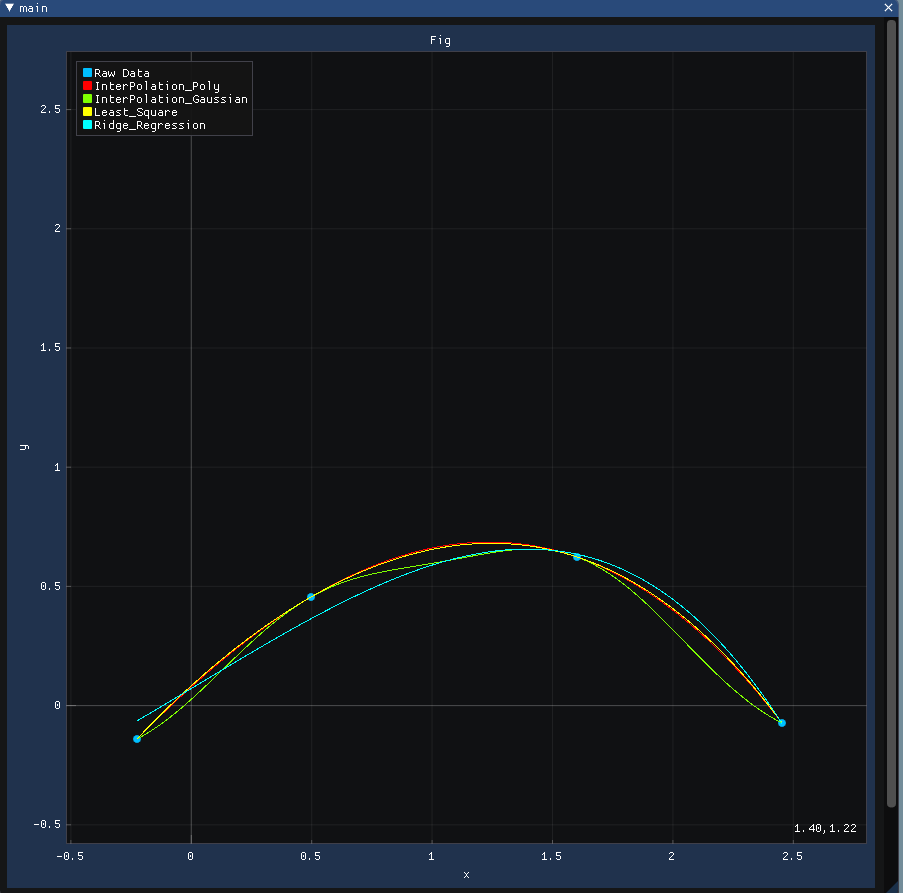
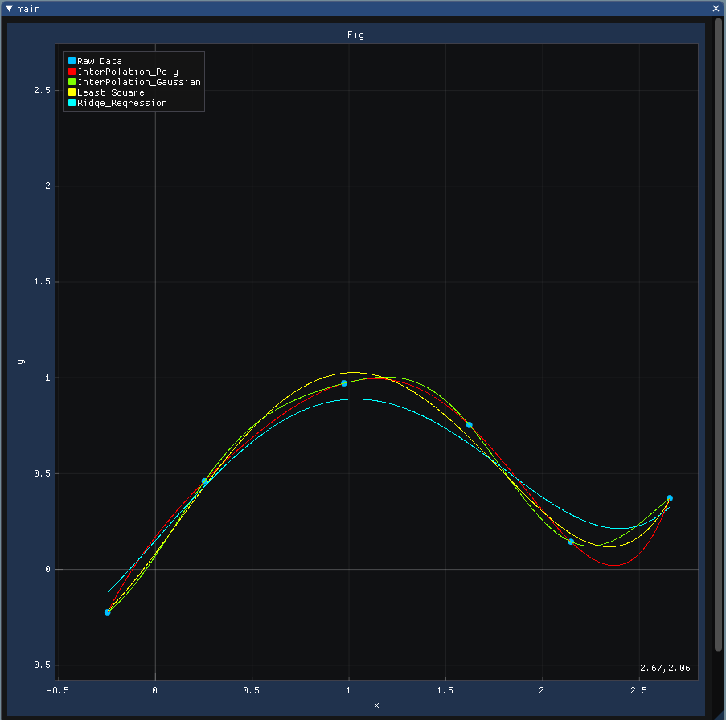
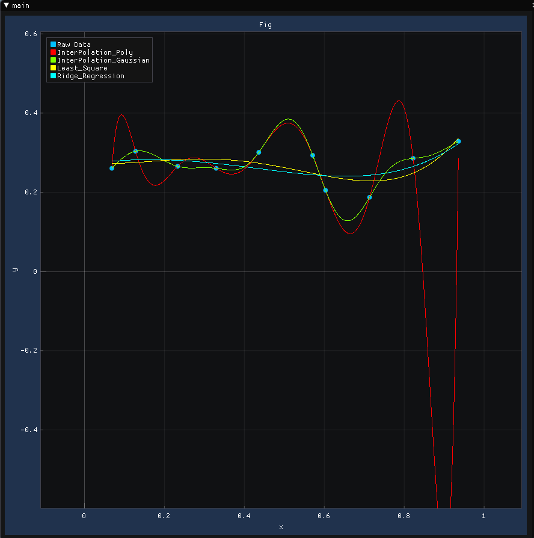
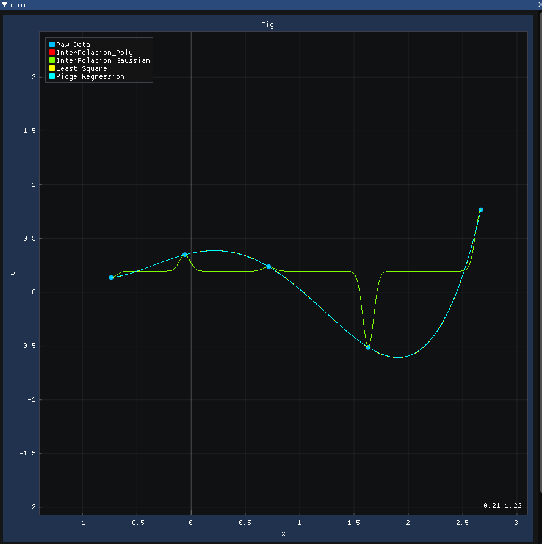
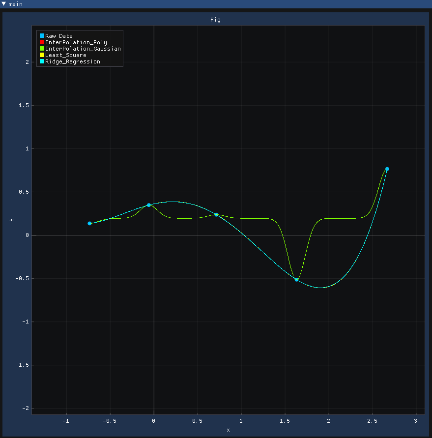
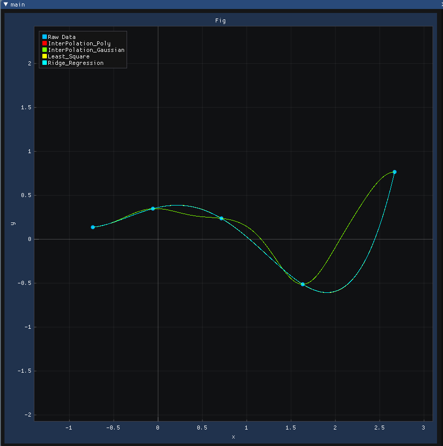
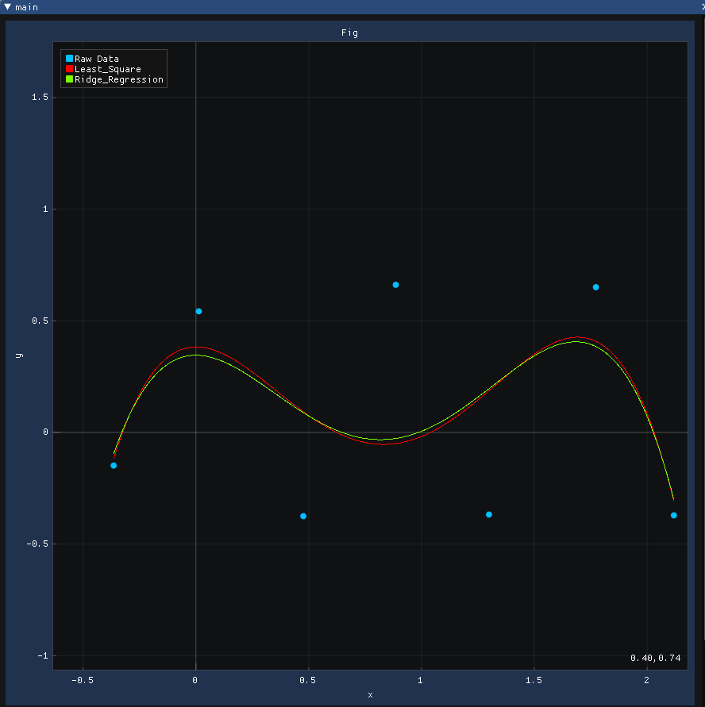
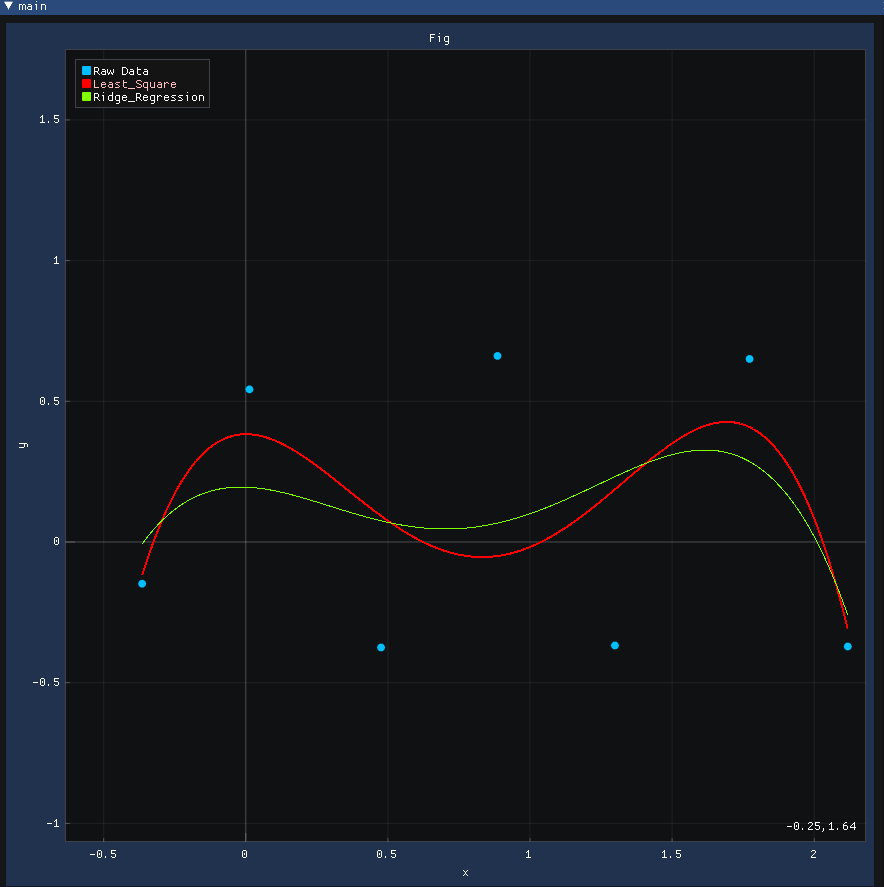
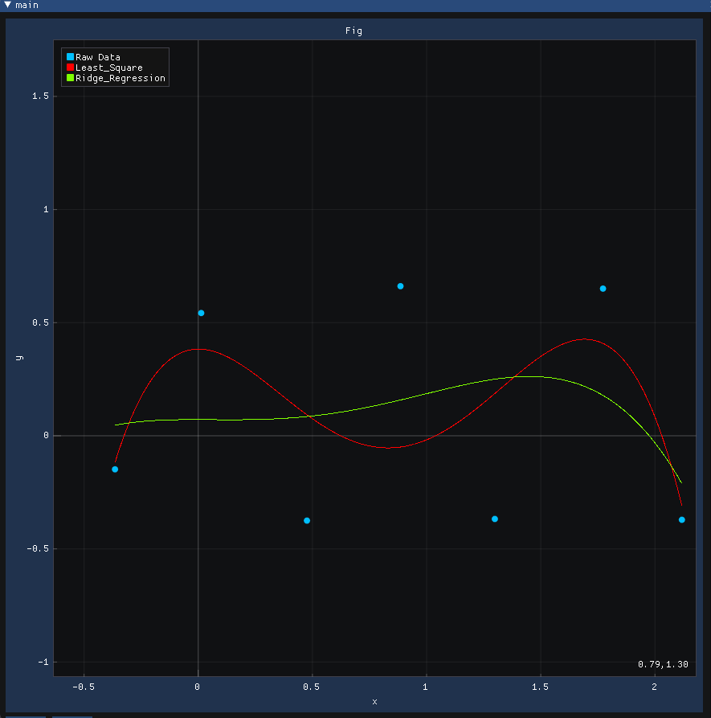
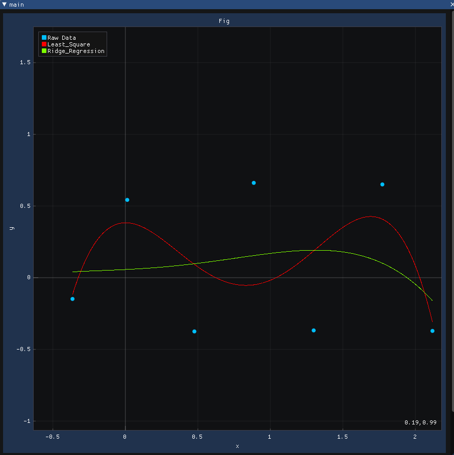

# 第一次作业报告

董莫 0027

## 问题描述

对一系列输入的点，用不同的方式作拟合，并对其进行比较。

### 插值型拟合方法

- 使用多项式函数（幂基函数的线性组合）$f(x)=\sum_{i=0}^{n-1}\alpha_i B_i(x)$ 插值 $\{P_j\}$，其中 $B_i(x)=x^i$ 

- 使用 Gauss 基函数的线性组合 $f(x)=b_0 + \sum_{i=1}^{n}b_i g_i(x)$  插值 $\{P_j\}$，其中
   $$
   g(x)=\exp\left(-\frac{(x-\mu)^2}{2\sigma^2}\right),\mu=x_1,x_2,\dots,x_n
   $$
  即对称轴在插值点上，$i=1,\dots,n$，缺省设 $\sigma =1$ 

**思考**：（1）变量比方程多，如何加约束条件？（2）常数项也可以改为一个低次（比如2次或3次）的多项式，相应也要加约束条件。

### 逼近型拟合方法

- 固定幂基函数的最高次数m (m<n)，使用最小二乘法：$\min E$，其中 $E(x)=\sum_{i=0}^{n}(y_i-f(x_i))^2$ 拟合 $\{P_j\}$。

- 岭回归（Ridge Regression）：对上述最小二乘法误差函数增加 $E_1$ 正则项，参数 $\lambda$，$\min (E+\lambda E_1)$，其中 $E_1=\sum_{i=1}^n\alpha_i^2$ 

**输出形式**：${P_k}(x_k,y_k),k=1,2,\dots,r$。$x_k$ 沿着 $x$ 轴均匀采样（r可以取得大些，点就密些），$y_k$ 根据拟合出来的函数计算出来，依次连接这些点的 polyline 作为该拟合函数的图像绘制出来。

**作业要求**：

- 实现上述四种拟合方法，并进行比较；如果同时画出，四种方法得到的曲线用不同颜色绘制；

- 实现框架不限：可以用课程提供的无境框架（C++）来做，也可以用 Matlab 等做；

- 提交（通过 SmartChair 系统）：作业报告，含做法、试验、比较结果等。

## 思路

- **多项式插值**：使用多项式对离散的点插值，n个点可以用n阶多项式拟合，求解一个线性系统即可得到，多项式阶数很高的时候会出现龙格现象。

- **Gauss基函数插值**：使用Gauss基函数进行插值，同样是通过n个点的函数值确定各项基函数的系数。需要一个形状参数$\sigma$，控制函数值随着离中心点距离增加的衰减程度。需求某区间上的积分或导数的积分为0等特定条件的时候需要添加一个多项式项$\sum_{j=0}^k\pi_j(x)$，相应的，矩阵变为：
  $$
  A=\left[\begin{array}{ccc}
  \phi_1(x_1)&\dots&\phi_m(x_1)&\pi_1(x_1)&\dots&\pi_k(x_1) \\
  \vdots&&\vdots&\vdots&&\vdots \\
  \phi_1(x_n)&\dots&\phi_m(x_n)&\pi_1(x_n)&\dots&\pi_k(x_n) \\
  \pi_1(x_1)&\dots&\pi_1(x_n)&0&\dots&0 \\
  \vdots&&\vdots&\vdots&&\vdots \\
  \pi_k(x_1)&\dots&\pi_k(x_n)&0&\dots&0
  \end{array}\right]
  $$

- **最小二乘拟合**：最优解是在最小二乘意义下函数与采样点之间的距离最近，可以通过对多项式系数$\alpha_i$求偏导得到一个线性系统：
  $$
  \frac{\partial\sum(\phi_i(x_i)-y_i)^2}{\partial\alpha_i}=0
  $$

- **岭回归**：在最小二乘拟合的基础上增加一个惩罚项$\lambda E$，使得拟合结果相比最小二乘拟合更接近平均，图像趋近平缓，能更好的排除异常项的影响。

## 代码实现

- 代码在linux下运行，其他操作系统没有测试过。

- 图形界面使用的是基于`glfw`的`imgui`，绘图使用`implot`，方程求解使用了`eigen`，make之后运行`example_glfw_opengl3`即可。

- 鼠标在坐标系中点击可以绘制插值点，点击“draw”按钮可以绘制，“clear”按钮全部清除。

- 下面的三个输入框分别是Gauss基函数的形状参数$\sigma$，逼近拟合的参数数量，岭回归的$\lambda$值。

- 如果glfw和eigen没有安装到系统，可能会需要设置一下，把glfw的安装路径下加入到环境变量`PKG_CONFIG_PATH`里，在makefile里的`CXXFLAGS`变量后面添加`-I`+eigen的路径。

## 运行结果

- 如图是试运行拟合的结果，分别是4个点和6个点的情况。

- 取10个点拟合，多项式插值出现了龙格现象。

- 取同样的5个点拟合，观察不同形状参数$\sigma$的影响。0.05 0.1 0.2 0.3
  - $\sigma=0.05$

  - $\sigma=0.1$

  - $\sigma=0.2$

  - $\sigma=0.3$

  - $\sigma决定了某点函数值衰减快慢与插值点距离的关系$

- 对比最小二乘与岭回归，观察$\lambda$对结果的影响，采用5个参数的多项式拟合，取7个插值点
  - $\lambda=0.001$

  - $\lambda=0.01$

  - $\lambda=0.1$

  - $\lambda=1$

  - $\lambda$越大，拟合受数据波动的影响越小