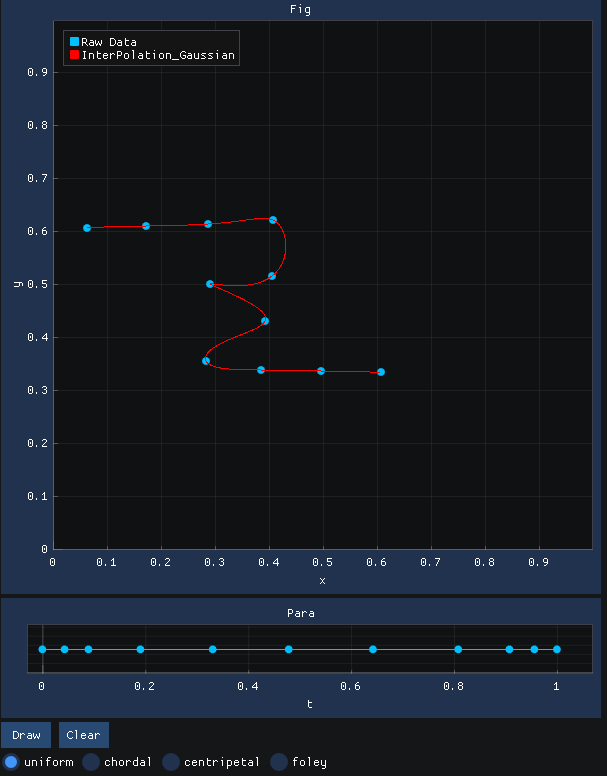

# 第三次作业报告

董莫 027

## 任务

使用单参数曲线来拟合平面上任意有序点列

### 目的

- 学习参数曲线拟合
- 使用各种参数化方法，并进行比较

### 要求

- 使用 Utopia 框架或其他语言（matlab，python 等）和框架
- deadline：2020 年 10 月 31 日晚

## 思路

本次作业实现的是参数化一个平面上的点列并拟合。重点是参数化并比较不同参数化方式之间的区别，参数化的时候需要关注每两个点之间的距离，以及每个点处的转角。

**参数化**：将高维空间中的低维几何结构映射到和几何体相同维度的低维空间中，一个好的参数化是希望该映射不损失信息的。在做曲线参数化的过程中，我们将点列映射到$[0,1]$的空间中。

- > **均匀参数化**：各个点的参数t均匀增加，做法简单，但是未考虑原来的点在空间中的位置分布，构造出的参数空间很可能会有较大的扭曲。
  > $$ t_{i+1}-t_i=const $$

- > **弦长参数化**：两个点在参数空间里的距离与原空间中的距离正比，考虑了空间中点的距离，但是是用弦长代替弧长。
  > $$ t_{i+1}-t_i=\left\| k_{i+1}-k_i \right\| $$

- > **中心参数化**：基于弦长参数化，但是将其结果开一次平方，将距离过近的点在参数空间中拉开一些距离。
  > $$ t_{i+1}-t_i=\sqrt{\left\| k_{i+1}-k_i \right\|} $$

- > **foley参数化**：同样基于弦长参数化，在每一段结果中乘以一个与其两端夹角和相邻长度相关的量。在实际操作的时候，两端的线段我只计算了一边的角度和相邻线段长。
  > $$ t_{i+1}-t_i= \left\| k_{i+1}-k_i \right\|\cdot (1+\frac{3}{2}\cdot\frac{\hat{\alpha}_i\cdot\left\|k_i-k_{i-1}\right\|}{\left\|k_i-k_{i-1}\right\|+\left\|k_{i+1}-k_i\right\|}+\frac{3}{2}\cdot\frac{\hat{\alpha}_{i+1}\cdot\left\|k_{i+2}-k_{i+1}\right\|}{\left\|k_{i+1}-k_{i}\right\|+\left\|k_{i+2}-k_{i+1}\right\|})$$
  > $$ \hat{\alpha}_i=\min(\pi-\alpha_i,\frac{\pi}{2}) $$
  > $$ \alpha_i=\angle(k_{i-1},k_i,k_{i+1}) $$

## 代码实现

- 代码的图形界面与交互使用`imgui`与`implot`，使用`eigen`进行矩阵运算。

- 鼠标在坐标系中点击可以绘制插值点，点击“draw”按钮可以绘制，“clear”按钮全部清除。

- 下面的四个选项框分别是四种参数化方法，中间的窗口显示了参数空间里点的距离。

- 曲线的近似表示使用了高斯基函数插值的方法，为了简便，$\sigma$取了参数空间线段长度的代数平均，因此同一组点在插值的时候基函数可以取到相同。

- **注意**：绘制的时候需要至少4个点！

## 运行结果

这次的作业我主要通过两个方面来比较各种参数化方法：平面线段的长度与夹角。

- 取点的时候使它们夹角接近，线段长度区别较大。
  - 均匀参数化  
    
  - 弦长参数化  
    
  - 中心参数化  
    
  - Foley参数化  
      
  中心参数化将距离较近的点在参数空间中拉远了距离，相较于弦长参数化，插值的时候不易产生振荡，而foley参数化在角度接近时效果与弦长参数化类似。

- 取点时候使线段长度接近，线段夹角区别大
  - 均匀参数化  
    
  - 弦长参数化  
    
  - 中心参数化  
    
  - Foley参数化  
      
  Foley参数化放大了夹角明显处在参数空间中的距离，从结果上看，在插值的时候，这样会使得原始点列的锐利特征保留，同时在进入一个角的时候不会带来额外的弯曲（如前三幅图所示）

此外，因为我采用的逼近方法是全局高斯基函数插值，并且选用的$\sigma$没有做调整，所以参数空间中的点分布不均时容易产生振荡，但若用均匀参数化强行使其分布均匀则会影响曲线的平滑，如下图所示
  - 均匀参数化  
    
  - 弦长参数化  
    
  - 中心参数化  
    
  - Foley参数化  
      
  所以工作中需要选择与实际情况相符合的参数化方法与点列逼近方法。